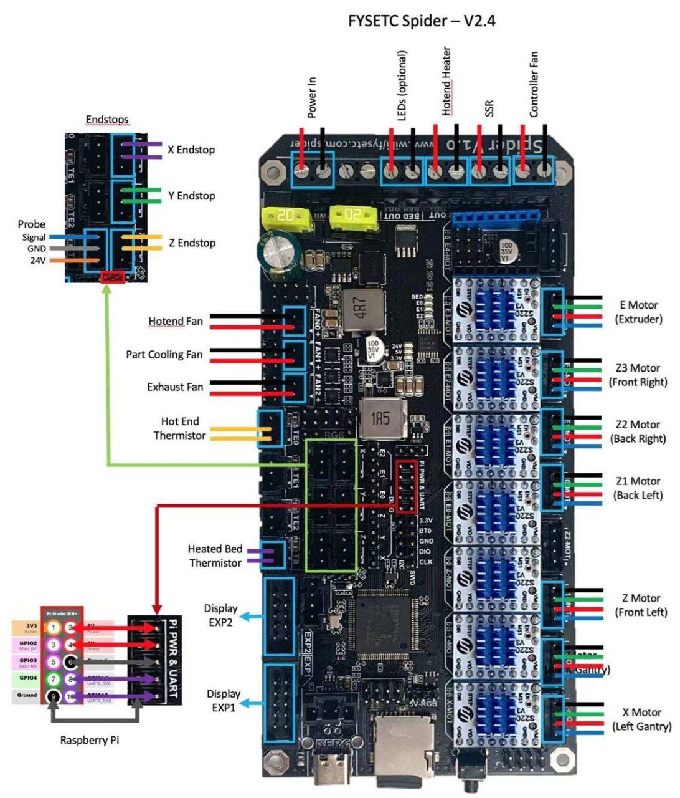
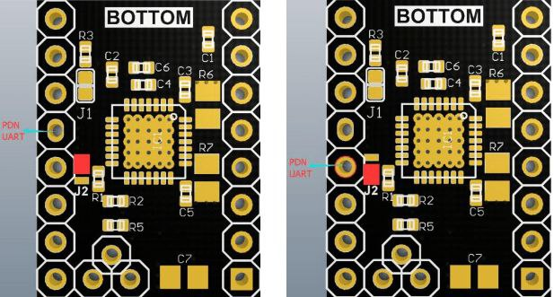

# FYSETC SPIDER


La Fysetc Spider ha sido diseñada teniendo en mente su uso en impresoras VORON 2.4 o similares, el equipo de VORON ha cooperado estrechamente durante el diseño y desarrollo de la misma.

Con un tamaño relativamente compacto para una paca de 8 drivers además dispone de muchas grandes funcionalidades que os explicaremos a continuación como adaptador de corriente a 12v 5A que nos permitirá alimentar ventiladores silenciosos sin necesidad de componentes externos, otro adapador de 5V 8A para tiras leds, alimentación directa de Raspberry Pi etc...

Si necesitas más información o ayuda no dudes a unirte al grupo de Telegram de FYSETC [https://t.me/fysetc](https://t.me/fysetc)‌

Os recordamos que tienes mas guias de ayuda en nuestro bot de Telegram [@ThreeDWorkHelpBot](https://t.me/ThreeDWorkHelpBot)



## Diagramas Fysetc Spider

En los siguientes diagramas de placa, cableado y de pines podréis encontrar las inmensas posibilidades y potencia de esta placa.


















## Características

* Tamaño compacto 155.3x76.5mm
* **Procesador STM32F446 a 180Mhz... una auténtica bestia!!!**
* **8 drivers con soporte UART y SPI** que en el caso de usar TMC cuentan con pines para una configuración sencilla
* Alimentación 24v con conversores de corriente a 12V/5A, **5V/8A \(especialmente pensado para Raspberry Pi, tiras leds y otros accesorios\)**
* Protección con fusibles de fácil sustitución para protección de la entrada de corriente principal y cama caliente
* Conector especial para sensor de nivelación adaptable a diferentes voltajes \(24v/5v/3.3v\) para la mayor compatibilidad
* 10 salidas PWM controladas por MOSFET!!!  \(1 cama caliente, 3 HotEnd, 3 ventiladores, 3 para tiras RGB\)
* 3 conectores para sensores de temperatura pudiendo usar thermistores o thermoacopladores \(AD597 necesario\)
* **Hasta 8 ventiladores controlables** \(usando solamente un extrusor y sin leds RGB\)!!!, 2 tiras RGB \(12v o 24v\) y **1 tira NeoPixel 5v**
* **Conectores UART para conexión y alimentación de una Raspberry Pi** sin necesitad de cables externos
* 2 conectores para módulos SD
* **Conector SD en la placa**
* **Conector USB C y conector opcional para USB Tipo-B**
* Conectores EXP para pantallas LDC/TFT o USART, I2C, CAN
* Sensores PT100 se pueden usar directamente

## Conexiones Fysetc Spider

### Jumper selección de fuente de alimentación

La Spider dispone de un jumper para seleccionar la alimentación a usar entre USB o adaptador interno 5V \(requiere la fuente de alimentación conectada\) que evita desagradables problemas que pueden ocurrir al mezclar alimentaciones diferentes.


### Conectores de alimentación

Tal como hemos comentado anteriormente esta placa dispone de un arsenal de conexiones y opciones así que la parte de alimentación no podría ser menos.


Disponemos de las siguientes conexiones de alimentación de componentes o de la propia placa las cuales están bien indicadas en la serigrafía así como la polaridad en ellas:

* Alimentación HotEnd, como ya comentamos esta placa puede controlar hasta 3 HotEnd independientes con lo que disponemos de 3 salidas de alimentación para estos \(E0/E1/E2 OUT\)
* Alimentación de nuestra cama caliente \(BED OUT\), si revisamos el esquema en puntos anteriores podremos conectar directamente nuestra cama 24v \(aunque siempre por protección es aconsejable el uso de un MOSFET externo\) o una cama 220v usando un relé SSR
* Alimentación dedicada para cama caliente \(BED IN\), normalmente conectado a nuestra fuente de alimentación en casos especiales con camas con mucho consumo podemos conectar ahí una fuente diferente dedicada para la cama exclusivamente
* Alimentación de la placa \(PWR IN\), no tiene mucho misterio... la alimentación proporcionada por nuestra fuente de alimentación para que toda la electrónica funcione

### Thermistores


La orientación de los **thermistores** normalmente no es importante ya que estos no suelen tener polaridad. En este caso para esta placa contamos para un conector para la cama caliente \(TB\) y tres para  calentadores de hotend \(TE0, TE1 y T2\).

Estos pines cuentan con resistencias PULL-UP de 4k7 que permiten el uso de sondas PT1000 de forma directa.

Es aconsejable usar conectores JST-XH 2.54mm ya que evitan que se produzcan desconexiones y se minimizan los falsos contactos.

### Drivers

Como ya hemos comentado esta placa cuenta con 8 zócalos para drivers lo cual nos ofrece un abanico de posibilidades de ampliación increibles.


Es importante resaltar que para el eje Z disponemos de dos salidas de motor para poder poner doble Z a nuestra máquina usando un solo driver. 


En el caso que no lo usemos es importante colocar jumpers en Z1-MOT para que funcionen correctamente dado que el splitter interno es serie.



#### Configuración de diferentes drivers

Aunque siempre es aconsejable configurar nuestros drivers en modos "inteligentes" SPI/UART la placa dispone de configuraciones para usar drivers en modo standalone.





**Para drivers Bigtreetech deberemos asegurarnos que esten en UART mediante el jumper soldado en la parte de abajo del propio driver.**







**Para drivers que usen SPI como TMC2130/TMC5160-1 o similares**. En el caso que usemos Sensorless \(homing sin finales de carreras físicos\), o no,  no es necesario cortar el pin DIAG ya que la placa cuenta con jumpers para ser habilitada esta función.









#### Dual X y Dual Z... Marlin

En el caso que queramos usar doble driver para los ejes de X y Z es importante que \(actualmente en versiones 2.0.8.x\) deberemos de colocar el segundo driver en los zócalos siguientes:


#### Sensorless drivers TMC

Si queremos utilizar esta funcionalidad de los drivers TMC que usa los motores como finales de carrera lo tendremos muy sencillo ya que la placa dispone de unos jumpers específicos para habilitar esta función, de todas formas os aconsejamos revisar nuestra [guía sensorless](../../../nivelacion/sensorless-homing-en-marlin.md) para conocer más de esta gran funcionalidad. 



**El uso de Sensorless es aconsejable únicamente para ejes X e Y**


### Endstops

En la Spider disponemos de 6 conectores para finales de carrera de 3 pines.


De nuevo Fysetc ha implementado mejoras muy interesantes en los conectores de final de carrera donde con mucha frecuencia conectamos sensores de nivelación que pueden requerir de diferentes voltajes así que se han incluido unos jumpers \(mediante puente de soldadura\) para que podamos escoger el voltaje que entregará cada conexión.


Podemos encontrar los siguientes bloques de conectores que pueden usar dos tipos de voltajes:

* Conectores **X+/Y+**, podremos escoger **5v o 3.3v \(defecto\)**... indicado por ejemplo para sensores bltouch de 5v
* Conectores **X-/Y-/Z-,** podremos escoger **24v o 3.3v \(defecto\)**... estos conectores están especialmente indicados para conectar sensores de nivelación inductivos/capacitativos
* Conector **Z+**, esta preparado para la conexión de un sensor de nivelación con servo al contar con el pin PA3 PWM podremos escoger mediante un jumper al lado de Z- el voltaje de placa 24v o 5v en el caso que usemos un sensor estilo Bltouch.

### Sensores de nivelación

En la Fysetc Spider contamos con diferentes formas de poner algo imprescindible o de gran ayuda actualmente para un ajuste perfecto de nuestras primeras capas... un sensor de nivelación. Vamos a explicar como conectar los dos tipos más usados.

#### Bltouch/3Dtouch

Para nosotros el mejor sensor de nivelación por precisión y por funcionar en practicamente cualquier impresora, por contra son más delicados además y aunque tenga un coste superior siempre aconsejamos por calidad general y precision el oringinal de Antclabs.

Os aconsejamos revisar la [guía de instalación en Marlin](../../../nivelacion/bltouch-3dtouch.md) aunque a continuación tenéis el esquema de conexión sugerido.



**Es importante colocar el jumper rojo en la posición de 5v para alimentar correctamente nuestro sensor.**
















#### Inductivo/Capacitativo

Son otros sensores todoterreno aunque tienen configuracion similares a otros estilo piezo o infrarrojos. Suelen ser más robusto y no actúan por contacto, por contra suelen tener menos precisión además de no ser compatible con según que superficies de cama como cristales.

A continuación podéis encontrar el esquema de conexión **es muy importante ajustar el pin de alimentación al voltaje adecuado para el sensor**.












### Conectores para LCD

Contamos con dos conectores EXP compatibles con la inmensa totalidad de pantallas de este tipo. En el siguiente esquema podremos ver el esquema de pines disponibles:


Ejemplo de conexiones para algunos modelos:



Una pequeña pero funcional pantalla para el modo emulación Marlin que con sus leds da mucho juego para personalizar tu impresora.


**IMPORTANTE!!! el conector EXP1 de la pantalla tiene que ir al conector EXP2 de la placa, el conector EXP2 de la pantalla tiene que ir al conector EXP1 de la placa.**






Unas de las pantallas más populares por su estupendo modo dual donde podemos disfrutar del modo emulación Marlin y su modo avanzado táctil, puedes encontrar más información en nuestra [guía](../../pantallas-bigtreetech-skr.md).


**IMPORTANTE!!! el conector EXP1 de la pantalla tiene que ir al conector EXP2 de la placa, el conector EXP2 de la pantalla tiene que ir al conector EXP1 de la placa.  
Ademñas de este cruce tiene que girarse en uno de los extremos 180º para ambos cables.**






Las pantallas usadas por muchas impresoras de Creality y derivadas. Estas normalmente cuentan con 3 conectores EXP \(EXP1/2/3\) donde uno de ellos \(EXP3\) es un tipo de conexión simplificado de los otros dos que normalmente solo se encuentra en placas Creality o similares.

En el caso de nuestra Fysetc deberemos usar los conectores EXP1 y EXP2 conectando directamente al correspondiente de la placa:



**IMPORTANTE!!! el conector EXP1 de la pantalla tiene que ir al conector EXP2 de la placa, el conector EXP2 de la pantalla tiene que ir al conector EXP1 de la placa.**




### 

### Neopixel/RGB

La Fysetc Spider cuenta con varias opciones para el uso de iluminación en nuestra impresora que siempre es útil ya sea para iluminar la zona de impresión, mostrar eventos de la impresora o porqué no darle un toque personalizado.

#### Tiras Neopixel/WS280x

Las tiras de led Neopixel son una excelente elección ya que con tan solo 3 cables podemos tener hasta 50 leds con iluminación inteligente.



**IMPORTANTE!!! la placa cuenta con una fuente de 5v que puede entregar un máximo de 8A \(si superamos 6A deberemos añadir un cooler al conversor de corriente\).   
Si usamos nuestra Raspberry Pi 3A se necesitan para ella, sumamos 1A para el uso del sistema con lo que nos quedan 4A para el sistema de iluminación.  
Aunque 4A nos darían para unos 66 leds se aconseja no sobrepasar de 3A, unos 50 leds, para dejar al menos 1A de margen.**


Cambios en Marlin en todo caso os aconsejamos revisar nuestra [guía para Neopixel](../../../otras-mejoras/leds-neopixel.md):

```cpp
// configuration.h
#define NEOPIXEL_LED // 3DWORK NEOPIXEL
  #define NEOPIXEL_PIN     PD3 // 3DWORK NEOPIXEL PIN CONTROL
  #define NEOPIXEL_PIXELS      20 // 3DWORK NEOPIXEL NUMERO LEDS

// configuration_adv.h
#define LED_CONTROL_MENU // 3DWORK NEOPIXEL MENU CONTROL LEDS
```

#### Tiras RGB

También podemos conectar nuestras tiras RGB aunque en este caso además de necesitar un mayor cableado estaremos limitados en el formato de los efectos dado que estas tiras no son gestionables por led individuales al contrario que las Neopixel.


Como viene siendo habitual Fysetc nos permite poder elegir el voltaje de trabajo, en este caso entre 24/12v así que ubicaremos un jumper seleccionando el que más nos convenga siguiendo las especificaciones de nuestra tira RGB.

Cambios en Marlin:

```cpp
// configuration.h
#define RGB_LED // 3DWORK RGB

// configuration_adv.h
#define LED_CONTROL_MENU // 3DWORK RGB MENU CONTROL LEDS

// Definición de pines incluidos en Marlin/src/pins/stm32f4/pins_FYSETC_S6.h
// SOLAMENTE INCLUIDOS A MODO DE REFERENCIA NO HAY QUE TOCAR NADA
#ifndef RGB_LED_R_PIN
  #define RGB_LED_R_PIN                     PB6
#endif
#ifndef RGB_LED_G_PIN
  #define RGB_LED_G_PIN                     PB5
#endif
#ifndef RGB_LED_B_PIN
  #define RGB_LED_B_PIN                     PB7
#endif
#ifndef RGB_LED_W_PIN
  #define RGB_LED_W_PIN                     -1
#endif
```

### Conexión Raspberry Pi \(Octoprint\)

Nuestra Fysetc Spider cuenta con un conector dedicado para la conexión de una Raspberry Pi normalmente para controlar nuestra impresora con [Octoprint](../../../../../octoprint/que_es_octoprint.md) o [Klipper](../../../../../klipper/klipper-1.md).


Este conector permite alimentar y conectar por UART nuestra Raspberry Pi, es interesante que la alimentación mediante el conector puede proveer hasta 8A. 

Para habilitar el puerto UART en nuestra Raspberry Pi deberemos reconfigurarla mediante raspi-config desde una linea de comandos SSH por ejemplo. 

```bash
sudo raspi-config
=> Interfacing Option
=> Serial
=> NO=> YES
sudo nano /boot/config.txt
=> add this line :dtoverlay=pi3-disable-bt
=> then
sudo rebootsudo 
nano /boot/cmdline.txt
=> remove the word phase "console=serial0,115200" or "console=ttyAMA0,115200"
sudo reboot
```

En cualquier caso podemos conectar mediante USB normal nuestra Raspberry por el puerto USB-C de la placa y además contamos con un conector JST para poder conectar internamente al USB de la Pi.


## Firmware

La Fysetc Spider es una placa muy versátil como ya hemos comentado a nivel de hardware y no iva a ser menos a nivel de software. 

La Spider es compatible con Marlin y Klipper aunque además dispone de una edición especial con más memoria para poder usarse con RRF \(Duet\).





