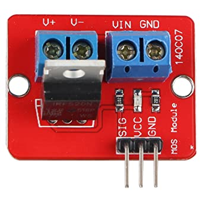

# Control de ventiladores con MOSFET externo

Nuestras placas usan un componente MOSFET para proveer de corriente a los diferentes perifericos que se conectan a ella. Básicamente un MOSFET es usado como un interruptor que actúa como amplificador de la señal recibida.

Os recordamos que tienes mas guias de ayuda en nuestro bot de Telegram [@ThreeDWorkHelpBot](https://t.me/ThreeDWorkHelpBot)

En el caso de las impresoras 3D este tipo de puertos se usan para ajustar una señal PWM. Esta señal se envía en pulsos más rápidos o lentos para cambiar la potencia de salida del ventilador.

Para poder realizar este tipo de cambios requerimos un MOSFET externo, aunque no esta enfocado al objetivo de la guía normalmente a nuestras impresoras 3D se suelen poner dos tipos de MOSFET externos

* MOSFET para la gestión del hotend o cama calientes, estos normalmente ayudan a proteger la electrónica de la placa y mejoran la potencia y estabilidad suministradas a estos componentes. Son muy aconsejables en el caso de uso de camas calientes ya que generan un alto consumo y desgaste sobre la electrónica.



* MOSFET para la gestión de ventiladores, en este caso suelen ser pequeños MOSFET que nos permitirán gestionar un ventilador ya sea para sustituir alguno dañado de la placa o como extra para usar en otras partes de nuestra impresora



Por otro lado y si estas buscando ventiladores te aconsejamos los siguientes:

* Ventiladores 4010 para hotend o electronica silenciosos \(12v!!!\)





{% embed url="https://www.amazon.es/Noiseblocker-BlackSilentFan-40mm-Ventilador-ordenador/dp/B0083A0BY4/ref=sr\_1\_2?\_\_mk\_es\_ES=%C3%85M%C3%85%C5%BD%C3%95%C3%91&dchild=1&keywords=noiseblocker+4010&qid=1619086367&sr=8-2" %}




{% embed url="https://www.amazon.es/Solutions-Silent-Carcasa-ordenador-Ventilador/dp/B00BF3S83C/ref=sr\_1\_1?\_\_mk\_es\_ES=%C3%85M%C3%85%C5%BD%C3%95%C3%91&dchild=1&keywords=silent+4&qid=1619086404&sr=8-1" %}



* Ventiladores 5015 para ventilación de capa \(24v\)





## Conexiónes de un MOSFET externo

Básicamente un módulo MOSFET dispone de 3 entradas/salidas:

* Entrada de activación, de donde recibe la señal por parte externa para la activación básicamente dependiendo del tipo de módulo son dos o tres pines:
  * GND que irá conectado al GND de la placa
  * SIG que es el pin de señal de la placa
  * VCC alimentación en el caso de disponer de controlador o led de control, este pin depende del modulo puede estar o no disponible
* Entrada de alimentación externa, es la fuente de corriente que mediante la activación del MOSFET entregará a la salida. En nuestro caso normalmente esta entrada irá conectada a nuestra fuente de alimentación. En la foto anterior serían los pines VIN/GND
* Salida alimentación hotend/cama/ventilador, es donde conectaremos el componente a controlar. En la foto anterior serían los pines V+/V-

## Reasignar pins en Marlin

Dependiendo del uso que queramos dar al módulo externo MOSFET necesitaremos realizar algunos cambios en nuestro firmware Marlin. En nuestro caso vamos a reasignar la función del control de un ventilador.

> **En el caso de ventiladores es importante entender que algunas placas es necesario activar \#define FAN\_**_**SOFT**_**\_PWM que se encuentra en configuration.h. En nuestro ejemplo usando una SKR 1.4 no es necesario especificarlo.**

### Que deshabilitar para poder trasladar la función de ventilador a otro pin?

Para poder trasladar de un pin que no funciona como el ventilador de capa podemos deberemos deshabilitar una asignación de pin al que queremos usar para poder asignarlo posteriormente.

Para poder ver donde están esas definiciones debemos encontrar el fichero pins de nuestra placa:

| Placa | Fichero pins |
| :--- | :--- |
| SKR 1.4 TURBO | `Marlin/src/pins/lpc1769/pins_BTT_SKR_V1_4_TURBO.h` |
| SKR 1.4 | `Marlin/src/pins/lpc1768/pins_BTT_SKR_V1_4.h` |
| SKR MINI TURBO | `Marlin/src/pins/lpx1769/pins_BTT_SKR_E3_TURBO.h` |

En el caso de querer trasladar un ventilador de pin tenemos que usar un pin compatible PWM para poder usar de forma adecuada nuestro modulo MOSFET externo.

#### Lista de pines PWM disponibles



* Verificados
  * **Z-Stop P1\_27**
  * **PWRDET P1\_00**
  * **I2C\_SCA1 P0\_00**
  * **I2C\_SCL1 P0\_01**
  * **SPI P0\_26 \(top left\) \(cercano a power CPU\) \(parece no usado por el puerto SPI\)**
  * **NEOPIXEL P1\_24**
  * **PROBE P0\_10**
* No verificados pero deberían de funcionar
  * **SERVO P2\_02**
* PWM pero normalmente en uso
  * **E1 Stepper pins,**
    * **E1 Enable P1\_16**
    * **E1 Step P1\_15**
    * **E1 Dir P1\_14**
  * **TFT Pins**
    * **TFT RX0 P0\_03**
    * **TFT TX0 P0\_02**
  * **Wifi Pins**
    * **Wifi TX3 P4\_28**
    * **Wifi RX3 P4\_29**
* PWM pero NO USAR!!!
  * **SPI\_SCK1 P0\_07**
  * **SPI\_MISO1 P0\_08**
  * **SPI\_MOSI1 P0\_09**







En nuestro caso para sustituir nuestro ventilador de capa estropeado vamos a usar los pines asociados con el control de detección de problema de corriente \(Power Loss Detection\) o el de gestión de encencido \(Power Supply Control\).

En este caso simplemente deshabilitaremos uno de ellos de la siguiente manera:

`//// Power Supply Control  
//#ifndef PS_ON_PIN   
//#define PS_ON_PIN P1_00 //3DWORK – Cambio para reasignar funcion`

`//// Power Loss Detection   
//#ifndef POWER_LOSS_PIN   
//#define POWER_LOSS_PIN P1_00 //3DWORK – Cambio para reasignar funcion`

## Activación controlada del ventilador del HotEnd

Un cambio muy aconsejable a nivel de ventiladores es, para placas que solamente tienen un pin de ventilador controlable y doble extrusión que no usemos... SKR 1.3 y 1.4 por ejemplo, el colocar nuestro ventilador del HotEnd y de refrigeración de la electrónica a la salida del extrusor 1 \(HE1\) o en uno de los pines que seleccionamos anteriormente

En ese caso podemos activarlo de la siguiente forma en configuration\_adv usando el pin que previamente desactivamos de su función normal:

`#define E0_AUTO_FAN_PIN P1_00 //3DWORK – Asignado pin ventilador hotend controlado a MOSFET externo`

O podemos como comentabamos anteriormente usarlo con la salida del extrusor 1 \(HE1\) si no lo estamos usando:

`#define E0_AUTO_FAN_PIN FAN1_PIN //3DWORK – Asignado pin ventilador hotend controlado a pin HE1`

En este caso podemos ajustar además a partir de que temperatura queremos ponerlo en marcha y a que velocidad \(el valor 255 equivaldría al 100% de velocidad de giro\):

`#define EXTRUDER_AUTO_FAN_TEMPERATURE 50  
#define EXTRUDER_AUTO_FAN_SPEED 255`

## Activación controlada de un ventilador de Cerramiento \(Chamber\)

Otro uso para añadir un ventilador controlable es como refrigeración de nuestro cerramiento si queremos tener un control de temperaturas.

`#define CHAMBER_FAN_PIN P1_00 //3DWORK – Asignado pin ventilador chamber controlado`

`#define CHAMBER_AUTO_FAN_TEMPERATURE 50  
#define CHAMBER_AUTO_FAN_SPEED 255`

## SegundoVentilador de Capa \(doble extrusor\)

En este caso el proceso es un poco diferente al anterior ya que debemos de modificar para cambiar el pin actual por el nuevo elegido.

### Fichero pins de nuestra placa

Revisando nuestro fichero nos encontraremos con la definición de FAN\_PIN, para nuestro caso y para nuestra SKR 1.4 lo haremos de la siguiente manera:

`# define FAN_PIN P2_03 // 3DWORK - pin original ventilador de capa  
# define FAN1_PIN P1_00 // 3DWORK - nuevo pin ventilador de capa`

### Configuration\_adv

Deberemos asignar el nuevo ventilador a nuestro segundo extrusor:

`# define FANMUX0_PIN P2_03 // 3DWORK - pin original ventilador de capa  
# define FANMUX1_PIN P1_00 // 3DWORK - nuevo pin ventilador de capa`

## Reparar pin de Ventilador de Capa

En el caso que nuestro pin de ventilador de capa falle, normalmente estan controlados por un MOSFET integrado y el sintoma de que esta roto es que esta continuamente al 100% sin posibilidad de ser controlado, el proceso es muy sencillo. 

Simplemente deberemos intercambiar los pines asignados entre los que usemos:

`# define FAN_PIN P1_00 // 3DWORK - nuevo pin ventilador MOSFET externo  
# define POWER_LOSS_PIN P2_03 // 3DWORK - antiguo pin ventilador roto`


En ocasiones, dependiendo del pin/mosfet/ventilador usado, es necesario ajustar Marlin para que la señal PWM se ajuste al cambio si nuestro ventilador no funciona como debiera.

Para ello podemos revisar si con **\#define FAN\_SOFT\_PWM** \(y otras dos opciones relacionadas con este cambio\) podemos hacer que esta señal funcione correctamente con nuestra configurracion.


